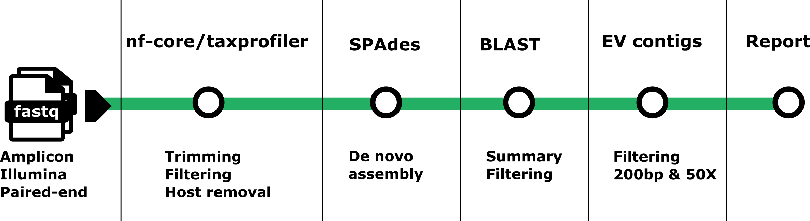

<p align="center">
  
</p>

<h1 align="center">EVICT</h1>

<p align="center">
  <i>Enterovirus Variant Identification and Contig Typing</i>
</p>


**EVICT**(Enterovirus Variant Identification and Contig Typing): Minimal pipeline for **Enterovirus genotyping** from **Illumina paired-end amplicons**.
Reads are pre-processed with **[nf-core/taxprofiler](https://github.com/nf-core/taxprofiler)** (adapter/primer trimming, low-complexity filtering, host-removal), then assembled with **SPAdes**, identified using **BLAST**. Enterovirus contigs are then extracted, filtered to retain only those longer than 200 bp with coverage greater than 50X, and summarized in a per-sample HTML report.

## Steps
- **taxprofiler** → trim/filter/host-remove
- **SPAdes** → de novo assembly (`--rnaviral`)
- **BLAST** → against `nt_viruses` (restricted by `taxid_EV.txt`)
- **Report** → simple HTML summary

<p align="center">
     
</p>

## Install
```bash
git clone git@github.com:LilyAnderssonLee/entero_typing.git
cd entero_typing
```
# Run (Conda)

```bash
conda env create -f assets/conda_env.yml
conda activate enterovirus_env
nextflow pull nf-core/taxprofiler -r 1.2.3
sbatch entero_typing.sh <ticket_id> <sample_id>
```
# Run (Singularity)

```bash
# Use a SIF image that contains spades/blast/seqkit/python libs
sbatch --export=EV_CONTAINER=/path/to/evtyping_1.0.sif entero_typing.sh <ticket_id> <sample_id>

```
# Run (Docker)

Recommended: run taxprofiler with Docker first, then run the rest inside your image.
```bash
# 1) taxprofiler (Docker profile)
ticket=111111
nextflow run nf-core/taxprofiler -r 1.2.3 -profile docker \
  --input data/${ticket}/${ticket}_samplesheet.csv \
  --databases assets/databases.csv \
  --outdir taxprofiler_results/${ticket} \
  --save_preprocessed_reads --perform_shortread_qc \
  --perform_shortread_complexityfilter --save_complexityfiltered_reads \
  --perform_shortread_hostremoval --hostremoval_reference /home/proj/development/microbial/metagenomics/references/GCF_009914755.1_T2T-CHM13v2.0_genomic.fna \
  --shortread_qc_adapterlist assets/primers_fw_rev_compliment.fasta \
  -params-file assets/params.json -c assets/custom_taxprofiler.config -resume

# 2) post-steps inside your Docker image (adjust <sample_id>)
sample=test_sample
docker run --rm -it \
  -v "$(pwd)":/home/proj/development/microbial/metagenomics/enterovirus \
  -w /home/proj/development/microbial/metagenomics/enterovirus \
  lilyanderssonlee2020/evtyping:1.0 \
  bash -lc "assets/pipeline_refactor.sh ${ticket} ${sample}"
```

# Inputs

The main script (assets/pipeline_refactor.sh) takes two args:
```php-template
<ticket_id>  <sample_id>
```

A ticket folder with per-sample FASTQs is expected. The script merges lanes, creates `data/<ticket>/<ticket>_samplesheet.csv`, then runs the steps above.

Edit paths (DB, refs, primers, etc.) at the top of `entero_typing.sh` if your environment differs.

# Outputs
```php-template
results/<ticket_id>/
  ├─ spades/<sample_id>/{contigs.fasta,scaffolds.fasta?,spades.log}
  ├─ blast/<sample_id>.{blast,blast.summary.csv}
  ├─ ev_contig/
  │   ├─ <sample_id>.fasta
  │   ├─ <sample_id>_200bp.fasta
  │   └─ <sample_id>_200bp_minCov50.fasta
  └─ report/<sample_id>.html
```

If there are no BLAST hits, the BLAST output aren’t created. `scaffolds.fasta` may be absent depending on SPAdes.

```php-template
taxprofiler_results/<ticket_id>/
  ├─ fastp/
  ├─ bbduk/
  ├─ bowtie2/
  │   └─ align/<sample_id>_<sample_id>.unmapped_{1,2}.fastq.gz
  ├─ fastqc/
  ├─ multiqc/
  ├─ samtools/
  └─ pipeline_info/
```

**Notes**
- **fastp/** – adapter & primer–trimmed reads
- **bbduk/** – low-complexity–filtered reads
- **bowtie2/** – host-removal outputs (alignments and unmapped FASTQs); reads unmapped to the human genome are used for SPAdes analysis.

To check the final **html report** in `example_results/1003460/report/`, please download and open it with your browser.

# Future plan

Convert current pipeline to a nextflow pipeline for better reproducibility and stability.


